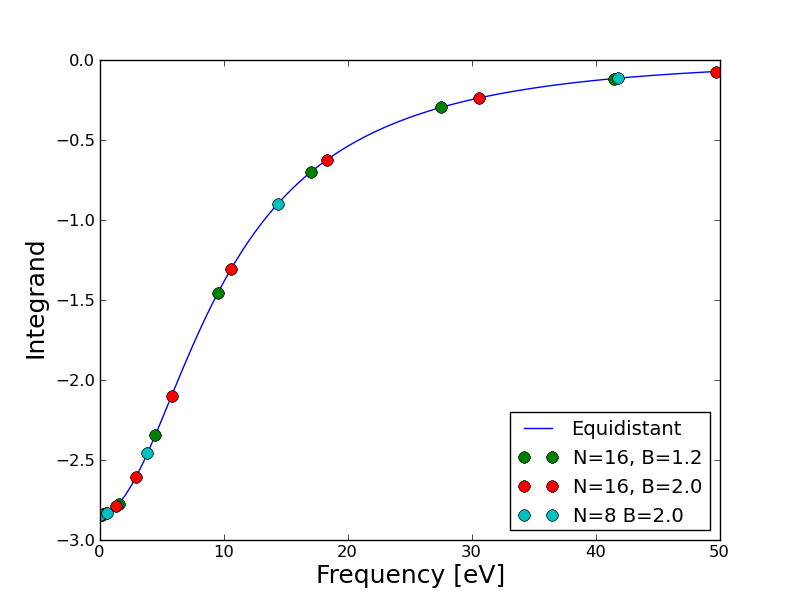

.. _rpa_tut:

==========================================================
Calculating RPA correlation energies
==========================================================

The Random Phase Approximation (RPA) can be used to derive a non-local expression for the ground state correlation energy. The calculation requires a large number of unoccupied bands and is significantly heavier than standard DFT calculation using semi-local exchange-correlation functionals. However, when combined with exact exchange the method has been shown to give a good description of van der Waals interactions as well as covalent bonds.

For more details on the theory and implemenation we refer to :ref:`rpa`. Below we give examples on how to calculate the RPA atomization energy of :math:`N_2` and the correlation energy of a Kr fcc lattice. Note that these tutorials will need a lot of CPU time and is essentially not possible without a supercomputer.

Example 1: Atomization energy of N2
===================================

The atomization energy of :mol:`N2` is overestimated by typical GGA functionals, and the RPA functional seems to do a bit better. This is not a general trend for small molecules, however, typically the HF-RPA approach yields to small atomization energies when evaluated at the GGA equilibrium geometry. See for example Furche \ [#Furche]_ for a table of atomization energies for small molecules calculated with the RPA functional. The main advantage is that RPA includes non-local correlation as well as giving a reasonable description of covalent bonds and the functional has no fitted parameters.

Ground state calculation
--------------------------

First we set up a ground state calculation with lots of unoccupied bands. This is done with the script:

.. literalinclude:: gs_N2.py

which takes on the order of 1000 CPU hours. The function set_Gvectors() determines how many bands one should converge in order include everything below 400 eV. The script generates N.gpw and N2.gpw which are the input to the RPA calculation. The PBE and non-selfconsistent Hartree-Fock energy is also calculated and written to the file PBE_HF.dat.

Converging the frequency integration
-------------------------------------

We will start by making a single RPA calculation with extremely fine frequency sampling. The following script returns the integrand at 2001 frequency points from 0 to 1000 eV at a particular q-point and a low cutoff energy (since there is no k-point sampling, only q=[0,0,0] is possible here and one therefore needs to specify a direction as well):

.. literalinclude:: frequency.py

The correlation energy is obtained as the integral of this function divided by :math:`2\pi` and yields -6.23738879181 eV. The frequency sampling is dense enough so that this value can be regarded as "exact". We can now test the Gauss-Legendre integration method with different number of points using the same script but now specifying the gauss_legendre parameters instead of a frequency list:: 

    Es = rpa.get_E_q(ecut=ecut, 
                     gauss_legendre=16,
                     frequency_cut=800, 
                     frequency_scale=2.0, 
                     integrated=False,
                     q=[0,0,0], 
                     direction=0)

This is the default parameters for Gauss-legendre integration. The gauss_legendre keyword specifies the number of points, the frequency_cut keyword sets the value of the highest frequency (but the integration is always an approximation for the infinite integral) and the frequency_scale keyword determines how dense the frequencies are sampled close to :math:`\omega=0`. The integrands for a few values of these parameters are shown below

and the value of the integral for a range of parameters is shown below (all values in eV)

========================  =========================  ===================   =================
Gauss-Legendre points     Frequency cutoff           Frequency scale       Integral
========================  =========================  ===================   =================
 8	          		100	 	        2.0		   -6.23695229669
 8	          		200	 	        2.0		   -6.23729041603
 8	          		400	 	        2.0		   -6.24096953919
 8	          		800	 	        2.0		   -6.22671709039
 8	          	 	1600	 	        2.0		   -6.26677707702
 8	          		800	 	        1.0		   -6.36563675431
 8	          		800	 	        1.5		   -6.23973197929
 8	          		800	 	        2.5		   -6.23421988399
 16	          		100	 	        2.0		   -6.23479287788
 16	          		200	 	        2.0		   -6.23713047805
 16	          		400	 	        2.0		   -6.2374055733
 16	          		800	 	        2.0		   -6.23743850193
 16	          		1600	 	        2.0		   -6.23743853397
 16	          		800	 	        1.0		   -6.23759331385
 16	          		800	 	        1.5		   -6.23847568048
 16	          		800	 	        2.5		   -6.23744377698
========================  =========================  ===================   =================

======================== =
Exact
======================== =
-6.23738879181	          		
======================== = 

It is seen that using the default values gives a result which is extremely well converged (to 0.1 meV). Below we will simply use the default values allthough we could perhaps use 8 points instead of 16, which would half the total CPU time for the calculations. In this particular case the result is not very sensitive to the frequency scale, but if the there is a non-vanishing density of states near the Fermi level, there may be much more structure in the integrand near :math:`\omega=0` and it is important to sample this region well. It should of course be remembered that these values are not converged with respect to the number of unoccupied bands and plane waves, which were determined by a rather low cutoff at 50 eV.

Extrapolating to infinite number of bands
-----------------------------------------

To calculate the atomization energy we need to obtain the correlation energy as a function of number of bands and extrapolate to infinity as explained in :ref:`rpa`. This is accomplished with the script:

.. literalinclude:: rpa_N2.py

which calculates the correlation part of the atomization energy with the bands and plane waved corresponding to the list of cutoff energies. Note that the default value of frequencies (16 Gauss-Legendre points) is used and the calculation parallelizes efficiently over the frequencies. The result is written to rpa_N2.dat and can be visualized with the script::

    import numpy as np
    from pylab import *

    A = np.loadtxt('rpa_N2.dat').transpose()
    plot(A[0]**(-1.5), A[1], 'o', label='Calculated points')

    xs = np.array([A[0,0]+i*100000. for i in range(50000)])
    plot(xs**(-1.5), -4.969+1993*xs**(-1.5), label='-4.969+1993*E^(-1.5)')

    t = [int(A[0,i]) for i in range(len(A[0]))]
    xticks(A[0]**(-1.5), t, fontsize=12)
    axis([0.,150**(-1.5), None, -4.])
    xlabel('Cutoff energy [eV]', fontsize=18)
    ylabel('RPA correlation energy [eV]', fontsize=18)
    legend(loc='lower right')
    show()

The result is shown below

.. image:: extrapolate.png
	   :height: 400 px

The fit is seen to be very good at the last three points and we find an extrapolated value of -4.97 eV for the correlation part of the atomization energy. The results are summarized below (all values in eV	)

======   =====   =====   ======       ============
PBE      HF      RPA     HF+RPA       Experimental
======   =====   =====   ======       ============
10.668	 4.821   4.969   9.777  	9.887
======   =====   =====   ======       ============

The RPA result seems to be much better than the PBE result. However, one should also be aware that due to the non-local nature of the RPA functional, very large supercells are needed to avoid spurious interactions between repeated images and the calculation done for the 6x6x6 cell used here is not expected to be fully converged with respect to super cell size. See ref. \ [#Harl]_ for more details on this.

Example 2: Interlayer separation in graphite
============================================

As an example involving k-point sampling, we calculate the interlayer separation of graphite

Ground state calculation
--------------------------

The following script performs a ground state calculation at various distances with the number of bands corresponding to 250 eV:

.. literalinclude:: gs_graph.py

Note that we define a Gamma-centered k-point grid in order to use the q-point symmetry in the response function calculation below.
For the large non-selfconsistent calculation, we use the conjugate gradient eigensolver, which is better suited for converging many unoccupied states. It also helps the eigensolver to include the 200 extra states, which are not converged. In the end, the RPA calculation needs to be converged with respect to the cutoff energy and it is often an advantage to set the cutoff at a higher level. Then one does not have to redo the ground state calculations to check if the RPA result changes when going to 300 eV.

Obtaining the RPA correlation energy
------------------------------------

In principle one should start by converging the frequency sampling as in Example 1, but in this tutorial we will just assume that the default sampling sampling of 16 Gauss-Legendre points is sufficient.

It is not possible to fully converge the RPA correlation energy with respect to the energy and number of unoccupied bands, but as in Example 1, the results of a few calculations can be extrapolated to the value corresponding to infinite cutoff. However, when taken as a function of cutoff energy, the slope of the extrapolated function is often independent of the unit cell volume. Therefore, energy differences often converge much faster and instead of extrapolating the correlation energy at all interlayer separations, we just comptre a few energy differences as a function of cutoff energy and check for convergence. Below we just assume that our cutoff energy is converged, but one should check this by a reference calculation at 300 eV. The following script calculates the RPA correlation energy at 250 eV at various interlayer separations.

.. literalinclude:: rpa_graph.py

The kcommsize=64 keyword tells the calculator to use 64 k-point domains and the calculation is thus parallelized with 9 k-points on each CPU. If the number of cpus is larger than kcommsize, parallelization over freqency points will be initiated, which is much less efficient than k-point parallelization. However, the memory consumption may sometimes be exceedingly high since the full response function is stored in all frequency points and parallelizing over frequencies may then be useful. When choosing a parallelization scheme, it should be noted that the response function involves a sum over all k-points and not just those in the irreducible part of reciprocal space. The total number of cpus should be equal to the number of frequency domains (divisible in frequency points) times the number of k-point domains (specified by kcommsize). The directions keyword tells the calculator to consider one direction paralle to the graphene layers weighted by 2/3 and one direction orthogonal to the layers weighted by 1/3 when doing the optical limit for q=[0,0,0].

The result can be plotted with the script:: 

.. literalinclude:: plot_graph.py

and is shown below along with the results obtained from LDA, PBE, vdW-DF, experiments, and Quamtum Monte Carlo (QMC)

.. image:: graphite.png
	   :height: 400 px

The RPA potential energy surface was obtained by adding the RPA c	orrelation energy to the Hartree-Fock energy which is calculated by
    
.. literalinclude:: hf_graph.py  

.. [#Furche] F. Furche,
             *Phys. Rev. B* **64**, 195120 (2001)

.. [#Harl] J. Harl and G. Kresse,
           *Phys. Rev. B* **77**, 045136 (2008)
